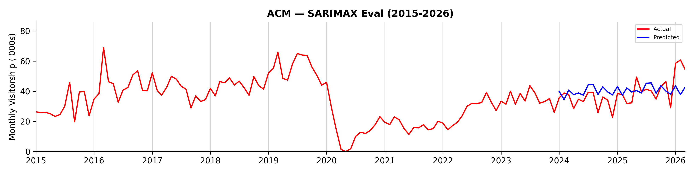
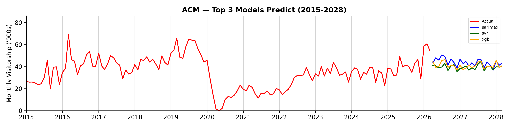

## Summary Report (ACM)

```
Branch:    test/run-pipelines-9a2
Generated: 21 Sep 2026 4.07pm
```

### Model Evaluation Results + Predictions

<table><thead><tr><th>Model</th><th>RMSE</th><th>MAPE</th><th>FY2026</th><th>FY2027</th></tr></thead><tbody><tr><td>SARIMAX</td><td>8.62</td><td>19.10%</td><td>541.8</td><td>507.9</td></tr><tr><td>Support Vector Regression</td><td>9.07</td><td>18.77%</td><td>475.1</td><td>472.6</td></tr><tr><td>XGBoost</td><td>9.09</td><td>20.44%</td><td>491.3</td><td>492.9</td></tr><tr><td>Random Forest Regressor</td><td>9.49</td><td>20.85%</td><td>495.4</td><td>482.7</td></tr><tr><td>Holt-Winters exponential smoothing</td><td>10.10</td><td>16.85%</td><td>713.9</td><td>837.8</td></tr><tr><td>LSTM</td><td>10.15</td><td>24.81%</td><td>469.8</td><td>459.5</td></tr><tr><td>Baseline Monthly Mean</td><td>15.85</td><td>30.54%</td><td>452.0</td><td>452.0</td></tr></tbody></table>

### Total Visitors ('000s) by Financial Year (SARIMAX)

<table align="left"><thead><tr><th width="138">FY</th><th width="148">Total Visitors ('000s)</th></tr></thead><tbody><tr><td>FY2014</td><td>78.2</td></tr><tr><td>FY2015</td><td>413.4</td></tr><tr><td>FY2016</td><td>522.4</td></tr><tr><td>FY2017</td><td>483.7</td></tr><tr><td>FY2018</td><td>572.7</td></tr><tr><td>FY2019</td><td>586.8</td></tr><tr><td>FY2020</td><td>153.2</td></tr></tbody></table><table align="right"><thead><tr><th width="138">FY</th><th width="148">Total Visitors ('000s)</th></tr></thead><tbody><tr><td>FY2021</td><td>197.1</td></tr><tr><td>FY2022</td><td>372.8</td></tr><tr><td>FY2023</td><td>424.4</td></tr><tr><td>FY2024</td><td>401.6</td></tr><tr><td>FY2025</td><td>529.9</td></tr><tr><td>FY2026 (Prediction)</td><td>541.8</td></tr><tr><td>FY2027 (Prediction)</td><td>507.9</td></tr></tbody></table><br clear="all">




