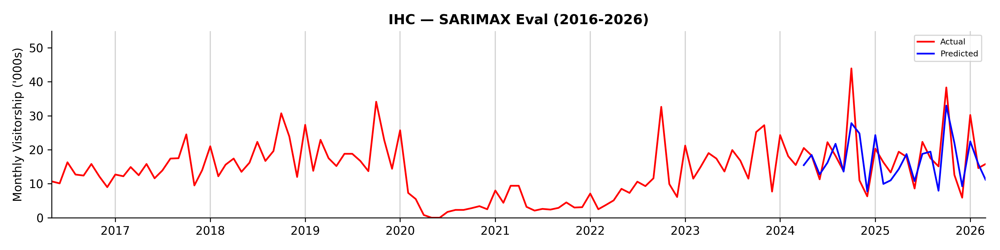
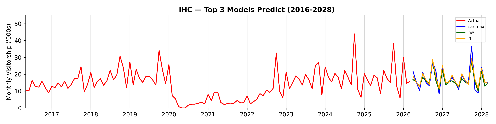

## Summary Report (IHC)

```
Branch:    test/run-pipelines-7b
Generated: 9 Sep 2026 12.16pm
```

### Model Evaluation Results + Predictions

<table><thead><tr><th>Model</th><th>RMSE</th><th>MAPE</th><th>FY2026</th><th>FY2027</th></tr></thead><tbody><tr><td>SARIMAX</td><td>6.12</td><td>28.56%</td><td>208.7</td><td>206.2</td></tr><tr><td>Holt-Winters exponential smoothing</td><td>6.19</td><td>35.66%</td><td>201.0</td><td>192.4</td></tr><tr><td>Random Forest Regressor</td><td>6.63</td><td>30.75%</td><td>211.6</td><td>209.7</td></tr><tr><td>LSTM</td><td>7.02</td><td>42.86%</td><td>231.1</td><td>230.0</td></tr><tr><td>XGBoost</td><td>7.39</td><td>37.74%</td><td>212.5</td><td>205.3</td></tr><tr><td>Baseline Monthly Mean</td><td>8.79</td><td>33.24%</td><td>216.6</td><td>216.6</td></tr></tbody></table>

### Total Visitors ('000s) by Financial Year (SARIMAX)

<table align="left"><thead><tr><th width="138">FY</th><th width="148">Total Visitors ('000s)</th></tr></thead><tbody><tr><td>FY2016</td><td>138.9</td></tr><tr><td>FY2017</td><td>185.5</td></tr><tr><td>FY2018</td><td>236.3</td></tr><tr><td>FY2019</td><td>210.5</td></tr><tr><td>FY2020</td><td>37.6</td></tr><tr><td>FY2021</td><td>46.5</td></tr></tbody></table><table align="right"><thead><tr><th width="138">FY</th><th width="148">Total Visitors ('000s)</th></tr></thead><tbody><tr><td>FY2022</td><td>148.6</td></tr><tr><td>FY2023</td><td>216.2</td></tr><tr><td>FY2024</td><td>215.3</td></tr><tr><td>FY2025</td><td>218.2</td></tr><tr><td>FY2026 (Prediction)</td><td>208.7</td></tr><tr><td>FY2027 (Prediction)</td><td>206.2</td></tr></tbody></table><br clear="all">



**Deepavali months: actual vs predicted (SARIMAX)**

| Month | Actual | Predicted | Difference | % difference |
|---|---|---|---|---|
| 2024-10 | 43.90 | 27.81 | -16.09 | -36.66% |
| 2025-10 | 38.30 | 32.96 | -5.34 | -13.95% |
| 2026-11 | -- | 21.93 | -- | -- |
| 2027-10 | -- | 36.69 | -- | -- |


