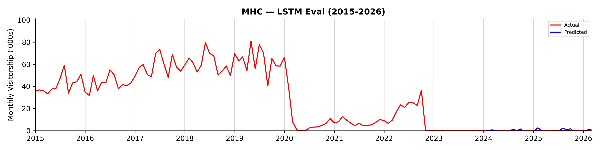

## Summary Report (MHC)

```
Branch:    test/run-pipelines-8c
Generated: 16 Sep 2026 12.41pm
```

### Model Evaluation Results + Predictions

<table><thead><tr><th>Model</th><th>RMSE</th><th>MAPE</th><th>FY2026</th><th>FY2027</th></tr></thead><tbody><tr><td>LSTM</td><td>1.79</td><td>690855854525644800.00%</td><td>506.1</td><td>697.9</td></tr><tr><td>Support Vector Regression</td><td>3.75</td><td>1352406305707303168.00%</td><td>535.2</td><td>632.5</td></tr><tr><td>XGBoost</td><td>4.56</td><td>1695836034043691520.00%</td><td>532.2</td><td>648.4</td></tr><tr><td>Random Forest Regressor</td><td>4.66</td><td>2096411149748996864.00%</td><td>433.4</td><td>631.1</td></tr><tr><td>Holt-Winters exponential smoothing</td><td>4.92</td><td>1823584433231552768.00%</td><td>-19.9</td><td>-61.3</td></tr><tr><td>SARIMAX</td><td>5.50</td><td>2098751002760350464.00%</td><td>341.3</td><td>341.9</td></tr><tr><td>Baseline Monthly Mean</td><td>8.26</td><td>3450535714501395456.00%</td><td>0.0</td><td>0.0</td></tr></tbody></table>

### Total Visitors ('000s) by Financial Year (LSTM)

<table align="left"><thead><tr><th width="138">FY</th><th width="148">Total Visitors ('000s)</th></tr></thead><tbody><tr><td>FY2014</td><td>109.1</td></tr><tr><td>FY2015</td><td>504.2</td></tr><tr><td>FY2016</td><td>558.1</td></tr><tr><td>FY2017</td><td>718.1</td></tr><tr><td>FY2018</td><td>741.6</td></tr><tr><td>FY2019</td><td>675.1</td></tr><tr><td>FY2020</td><td>59.5</td></tr></tbody></table><table align="right"><thead><tr><th width="138">FY</th><th width="148">Total Visitors ('000s)</th></tr></thead><tbody><tr><td>FY2021</td><td>84.7</td></tr><tr><td>FY2022</td><td>171.5</td></tr><tr><td>FY2023</td><td>0.0</td></tr><tr><td>FY2024</td><td>0.0</td></tr><tr><td>FY2025</td><td>0.0</td></tr><tr><td>FY2026 (Prediction)</td><td>506.1</td></tr><tr><td>FY2027 (Prediction)</td><td>697.9</td></tr></tbody></table><br clear="all">




