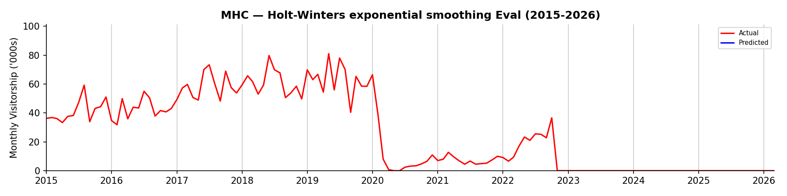
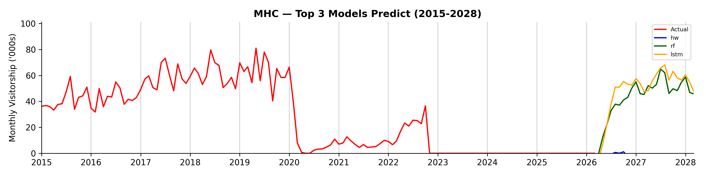

## Summary Report (MHC)

```
Branch:    test/run-pipelines-7a
Generated: 15 Sep 2026 8.23pm
```

### Model Evaluation Results + Predictions

<table><thead><tr><th>Model</th><th>RMSE</th><th>MAPE</th><th>FY2026</th><th>FY2027</th></tr></thead><tbody><tr><td>Holt-Winters exponential smoothing</td><td>4.92</td><td>1823584433231552768.00%</td><td>-19.9</td><td>-61.3</td></tr><tr><td>Random Forest Regressor</td><td>5.34</td><td>2403152512409692160.00%</td><td>423.8</td><td>632.7</td></tr><tr><td>LSTM</td><td>7.87</td><td>2961306499691800576.00%</td><td>484.1</td><td>695.9</td></tr><tr><td>Baseline Monthly Mean</td><td>8.26</td><td>3450535714501395456.00%</td><td>0.0</td><td>0.0</td></tr><tr><td>XGBoost</td><td>9.01</td><td>3772689469941228544.00%</td><td>493.0</td><td>665.3</td></tr><tr><td>Support Vector Regression</td><td>10.40</td><td>4430603792411568128.00%</td><td>492.8</td><td>627.4</td></tr><tr><td>SARIMAX</td><td>12.14</td><td>4849820618190751744.00%</td><td>163.5</td><td>46.8</td></tr></tbody></table>

### Total Visitors ('000s) by Financial Year (Holt-Winters exponential smoothing)

<table align="left"><thead><tr><th width="138">FY</th><th width="148">Total Visitors ('000s)</th></tr></thead><tbody><tr><td>FY2014</td><td>109.1</td></tr><tr><td>FY2015</td><td>504.2</td></tr><tr><td>FY2016</td><td>558.1</td></tr><tr><td>FY2017</td><td>718.1</td></tr><tr><td>FY2018</td><td>741.6</td></tr><tr><td>FY2019</td><td>675.1</td></tr><tr><td>FY2020</td><td>59.5</td></tr></tbody></table><table align="right"><thead><tr><th width="138">FY</th><th width="148">Total Visitors ('000s)</th></tr></thead><tbody><tr><td>FY2021</td><td>84.7</td></tr><tr><td>FY2022</td><td>171.5</td></tr><tr><td>FY2023</td><td>0.0</td></tr><tr><td>FY2024</td><td>0.0</td></tr><tr><td>FY2025</td><td>0.0</td></tr><tr><td>FY2026 (Prediction)</td><td>-19.9</td></tr><tr><td>FY2027 (Prediction)</td><td>-61.3</td></tr></tbody></table><br clear="all">




