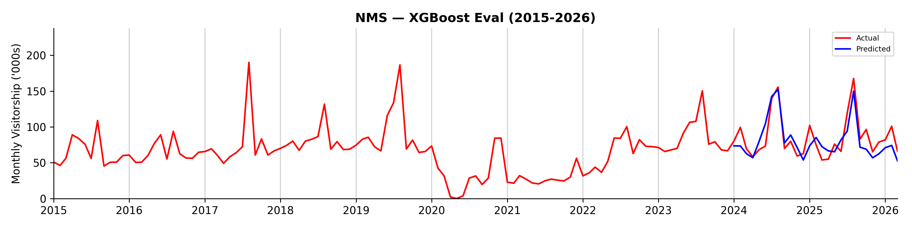
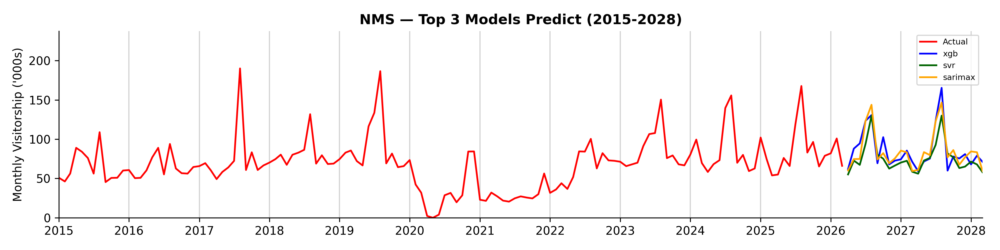

## Summary Report (NMS)

```
Branch:    test/run-pipelines-8c
Generated: 16 Sep 2026 12.19pm
```

### Model Evaluation Results + Predictions

<table><thead><tr><th>Model</th><th>RMSE</th><th>MAPE</th><th>FY2026</th><th>FY2027</th></tr></thead><tbody><tr><td>XGBoost</td><td>16.34</td><td>17.40%</td><td>1,042.5</td><td>1,007.5</td></tr><tr><td>Support Vector Regression</td><td>19.61</td><td>14.77%</td><td>904.8</td><td>912.3</td></tr><tr><td>SARIMAX</td><td>20.07</td><td>20.48%</td><td>1,006.4</td><td>1,028.7</td></tr><tr><td>Random Forest Regressor</td><td>21.68</td><td>18.90%</td><td>1,030.7</td><td>977.9</td></tr><tr><td>LSTM</td><td>23.19</td><td>18.34%</td><td>937.1</td><td>934.9</td></tr><tr><td>Baseline Monthly Mean</td><td>36.40</td><td>30.13%</td><td>1,040.0</td><td>1,040.0</td></tr><tr><td>Holt-Winters exponential smoothing</td><td>43.75</td><td>35.34%</td><td>1,275.8</td><td>1,375.8</td></tr></tbody></table>

### Total Visitors ('000s) by Financial Year (XGBoost)

<table align="left"><thead><tr><th width="138">FY</th><th width="148">Total Visitors ('000s)</th></tr></thead><tbody><tr><td>FY2014</td><td>153.4</td></tr><tr><td>FY2015</td><td>783.1</td></tr><tr><td>FY2016</td><td>811.4</td></tr><tr><td>FY2017</td><td>930.7</td></tr><tr><td>FY2018</td><td>977.6</td></tr><tr><td>FY2019</td><td>1,003.8</td></tr><tr><td>FY2020</td><td>359.7</td></tr></tbody></table><table align="right"><thead><tr><th width="138">FY</th><th width="148">Total Visitors ('000s)</th></tr></thead><tbody><tr><td>FY2021</td><td>369.6</td></tr><tr><td>FY2022</td><td>852.9</td></tr><tr><td>FY2023</td><td>1,065.4</td></tr><tr><td>FY2024</td><td>998.1</td></tr><tr><td>FY2025</td><td>1,056.5</td></tr><tr><td>FY2026 (Prediction)</td><td>1,042.5</td></tr><tr><td>FY2027 (Prediction)</td><td>1,007.5</td></tr></tbody></table><br clear="all">




