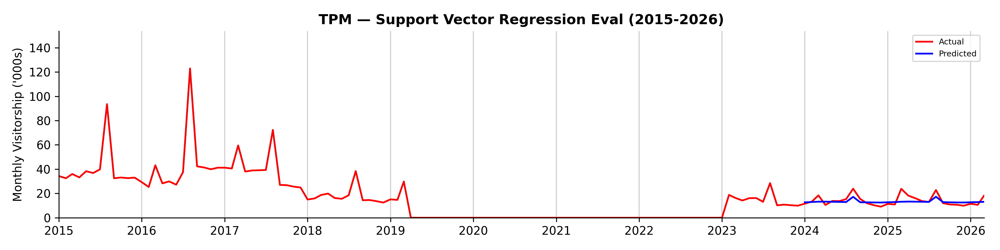
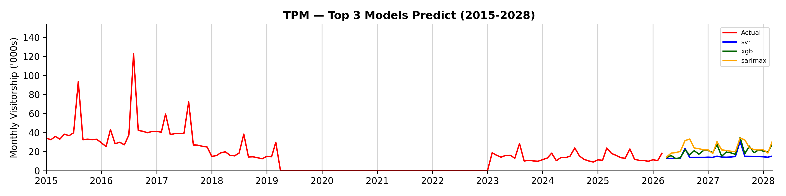

## Summary Report (TPM)

```
Branch:    test/run-pipelines-7a
Generated: 15 Sep 2026 8.05pm
```

### Model Evaluation Results + Predictions

<table><thead><tr><th>Model</th><th>RMSE</th><th>MAPE</th><th>FY2026</th><th>FY2027</th></tr></thead><tbody><tr><td>Support Vector Regression</td><td>3.55</td><td>17.72%</td><td>175.0</td><td>192.6</td></tr><tr><td>XGBoost</td><td>4.19</td><td>24.24%</td><td>221.5</td><td>257.8</td></tr><tr><td>SARIMAX</td><td>4.49</td><td>24.47%</td><td>276.1</td><td>289.9</td></tr><tr><td>LSTM</td><td>4.84</td><td>26.70%</td><td>232.8</td><td>293.7</td></tr><tr><td>Random Forest Regressor</td><td>5.25</td><td>24.20%</td><td>219.0</td><td>235.2</td></tr><tr><td>Baseline Monthly Mean</td><td>10.17</td><td>68.14%</td><td>170.1</td><td>170.1</td></tr><tr><td>Holt-Winters exponential smoothing</td><td>12.93</td><td>88.56%</td><td>166.6</td><td>171.6</td></tr></tbody></table>

### Total Visitors ('000s) by Financial Year (Support Vector Regression)

<table align="left"><thead><tr><th width="138">FY</th><th width="148">Total Visitors ('000s)</th></tr></thead><tbody><tr><td>FY2014</td><td>102.8</td></tr><tr><td>FY2015</td><td>470.6</td></tr><tr><td>FY2016</td><td>551.8</td></tr><tr><td>FY2017</td><td>381.5</td></tr><tr><td>FY2018</td><td>223.3</td></tr><tr><td>FY2019</td><td>0.0</td></tr><tr><td>FY2020</td><td>0.0</td></tr></tbody></table><table align="right"><thead><tr><th width="138">FY</th><th width="148">Total Visitors ('000s)</th></tr></thead><tbody><tr><td>FY2021</td><td>0.0</td></tr><tr><td>FY2022</td><td>35.1</td></tr><tr><td>FY2023</td><td>172.6</td></tr><tr><td>FY2024</td><td>170.1</td></tr><tr><td>FY2025</td><td>167.6</td></tr><tr><td>FY2026 (Prediction)</td><td>175.0</td></tr><tr><td>FY2027 (Prediction)</td><td>192.6</td></tr></tbody></table><br clear="all">




